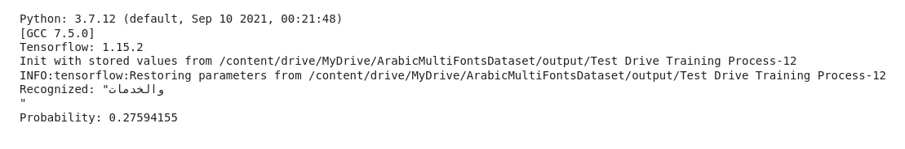
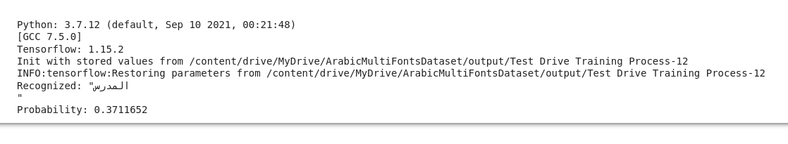

# persian-ocr-deeplearning

## Run on Local Computer

- Clone/fork the repository to your local host.
- Create python virtual environment in the repository directory.

  sudo apt-get install python3-venv
  
  python3 -m venv env

- Activate python virtual environment.

  source ./env/activate
  
  Update pip
  
  pip install --upgrade pip

- install the required python libraries (this script uses TensorFlow version 1.x).

  pip install -r requirements.txt

- Download sample dataset from:
  https://drive.google.com/drive/folders/1mRefmN4Yzy60Uh7z3B6cllyyOXaxQrgg?usp=sharing
  ```
  need to edit
  ```

  A suitable dataset for initial training is the (1_nice_60000_rows) dataset.

  Download the two files of that dataset are:
  
    1_nice_60000_rows.bin
    https://drive.google.com/file/d/1K2EzzIwI5A0rJ0X0yQGj4p_bpo1hs0Sm/view?usp=sharing
    
    and 
    
    1_nice_60000_rows.txt
    https://drive.google.com/file/d/1uLf5ijOcupi-JuYZWYj7s6Jb-d2u2i4B/view?usp=sharing

- Save dataset files in the dataset folder of the project (the location of the data files can be changed in Config.py).

- Configurations of the run session can be adjusted in the Config.py, this includes folders names, the dataset files, the session type e.g. Train, Test, Infer and many other settings.

- Initial setting of the configuration is:

- BASE_FILENAME = "1_nice_60000_rows"
- OPERATION_TYPE = OperationType.Training
- REGENERATE_CHARLIST_AND_CORPUS = True
- TRAINING_SAMPLES_PER_EPOCH = 5000
- BATCH_SIZE = 100
- IMAGE_WIDTH = 128
- IMAGE_HEIGHT = 32
- MAX_TEXT_LENGTH = 32

- In the terminal window, goto src folder and run python Main.py.
- The code will generate training, validation and testing dataset from (1_nice_60000_rows) dataset, and the training session will start.

Different datasets can be generated using https://github.com/msfasha/TextImagesToolkit

##Recognizing single images
After training the model, you can set the **OPERATION_TYPE = OperationType.Infer** and define
the path to the Arabic word images to be recognized:

Sample image 0.png



Sample image 1.png



